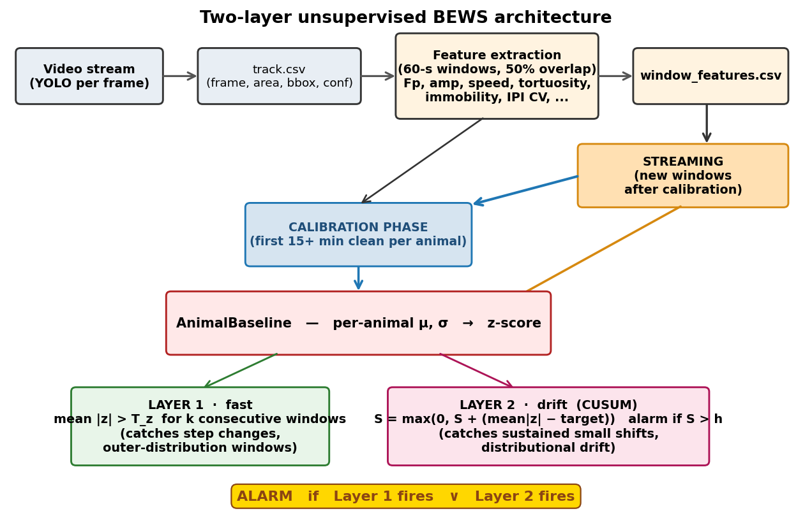
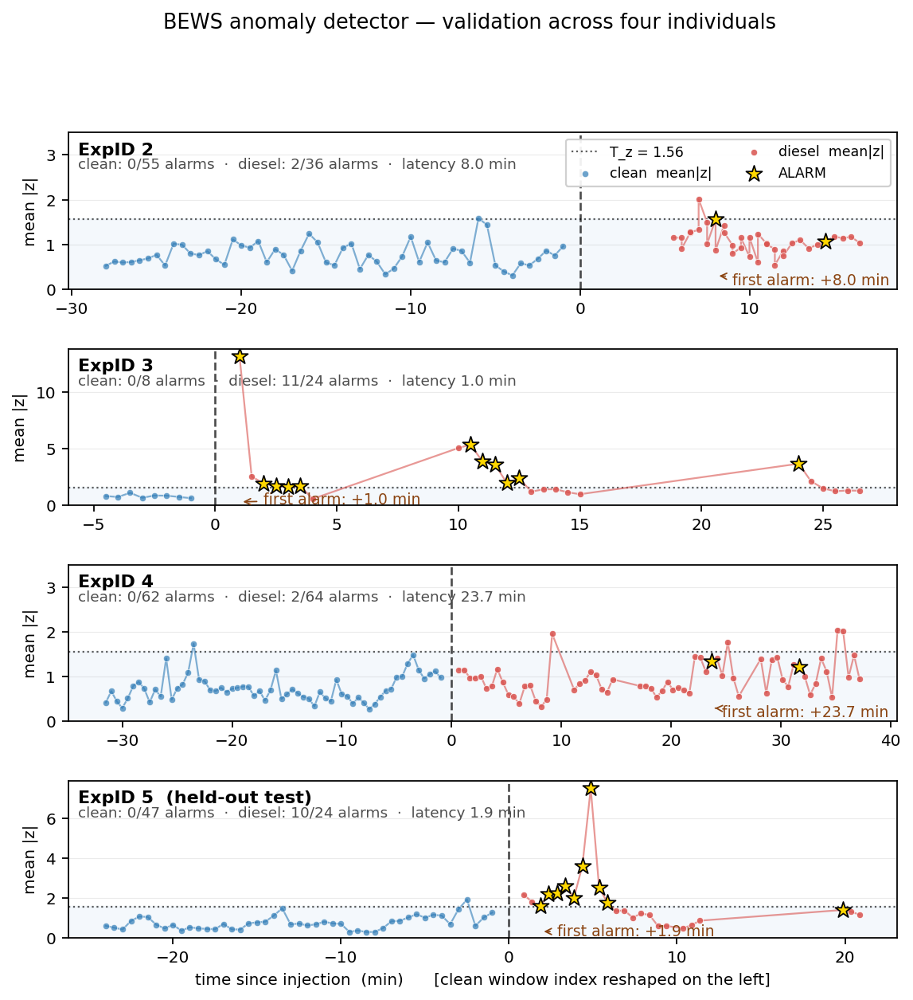

# Jellyfish

**Unsupervised behavioural Biological Early Warning System (BEWS) for marine pollution detection,
using the moon jellyfish *Aurelia aurita* as a biosensor.**

This repository accompanies a research project that uses computer vision to track jellyfish in a
laboratory aquarium, extract movement and pulsation features, and detect water pollution events
with a two-layer anomaly detector calibrated against each animal's own clean-water baseline.

The detector has been validated on five individuals exposed to diesel fuel, achieving **0 % false
alarms across 219 clean-water windows** and **detecting all five pollution events**, with detection
latencies between 1.0 and 23.7 minutes depending on the animal's response phenotype.



---

## Overview

| Stage | What happens | Code |
|---|---|---|
| 1. Detection | YOLO model emits a bounding box around the medusa per frame → `track.csv` | (external) |
| 2. Feature extraction | Per-frame data is reduced to 11 features over 60-s windows | `src/pipeline.py` |
| 3. Per-animal calibration | First 15+ minutes of clean water fit μ, σ for each feature | `src/bews.py · AnimalBaseline` |
| 4. Anomaly detection | Two-layer detector raises an alarm on each new window | `src/bews.py · BEWSDetector` |
| 5. Threshold calibration | Pooled clean-water scores from training animals fix T_z, target, h | `src/bews.py · calibrate_thresholds` |

The detector is **fully unsupervised** — it never sees a labelled "pollution" example. It learns
what *clean* looks like for each animal and triggers when the animal's behaviour drifts too far
from that baseline. This was a deliberate design choice driven by the empirical observation that
the direction of behavioural response to pollution is highly individual: some animals slow down,
some speed up, some show biphasic responses. See `docs/methodology.docx` for the full rationale.

## Two-layer detector in one paragraph

For every 60-s feature window, eight behavioural features are z-scored against the animal's own
clean-water mean and standard deviation. The mean of the absolute z-scores, `mean|z|`, is a single
scalar that measures how far the window departs from the animal's clean baseline. Two layers
operate on this scalar in parallel:

- **Layer 1** flags windows where `mean|z|` exceeds a threshold T_z for k = 3 consecutive windows.
  This catches step changes — animals that respond sharply to pollution.
- **Layer 2** is a one-sided CUSUM that accumulates small positive deviations of `mean|z|` above
  a target value and fires when the running sum exceeds a threshold h. This catches slow drifts
  that no single window flags.

An alarm is raised when either layer fires.



## Why no Layer 3?

An earlier prototype included an IsolationForest novelty layer intended to flag unusual *combinations*
of features that don't manifest as a large `mean|z|`. Empirical analysis on five individuals showed
it produced **zero unique true positives** — every window it flagged was already flagged by Layer 1 —
because the toxicological response is monotonic along the dominant axis already captured by `mean|z|`.
It was removed. The simplified two-layer architecture has identical sensitivity at lower implementation
complexity and zero machine-learning dependencies (NumPy + pandas only).

## Quick start

```bash
git clone https://github.com/<your-username>/jellyfish.git
cd jellyfish
pip install -r requirements.txt
jupyter notebook notebooks/bews_demo.ipynb
```

The notebook walks through the full pipeline on the example data. To run on your own data,
edit the `EXPERIMENTS` dictionary in the configuration cell.

## Minimal deployment example

```python
from bews import AnimalBaseline, BEWSDetector

# 1. Calibrate once per animal on its own clean recording
baseline = AnimalBaseline().fit(clean_window_features)

# 2. Use globally-calibrated thresholds (shipped with the system)
detector = BEWSDetector(
    threshold_mean_abs_z=1.559,
    cusum_target=0.715,
    cusum_h=5.498,
    k_consecutive=3,
)

# 3. Score every new window
result = detector.apply(baseline.score(new_window_batch))
if result['alarm'].any():
    raise_alert()
```

That is the entire detector at deployment. No neural-network weights to ship, no GPU, ~10 lines of
glue code around `bews.py`.

## Repository layout

```
jellyfish/
├── README.md                       this file
├── LICENSE                         MIT
├── requirements.txt                NumPy, SciPy, pandas, matplotlib (no scikit-learn)
├── pyproject.toml                  package metadata
├── src/
│   ├── bews.py                     two-layer detector module (~180 lines, no ML deps)
│   └── pipeline.py                 reference feature-extraction pipeline
├── notebooks/
│   └── bews_demo.ipynb             end-to-end walkthrough on example data
├── data/example/
│   ├── track.csv                   one example YOLO output (~22 min recording)
│   └── window_features_PA300032.csv  one example feature window output
├── docs/
│   ├── methodology.docx            full Section 3 of the manuscript
│   └── figures/                    architecture and validation plots
├── scripts/
│   └── run_pipeline.py             CLI: track.csv → window_features.csv
└── tests/
    └── test_bews.py                unit tests for the detector module
```

## Validation summary

| ExpID | Role | Clean windows | Diesel windows | False alarms | True detection | Latency (min) |
|------:|------|--------------:|---------------:|:------------:|:--------------:|--------------:|
|     2 | calibration  | 55 | 36 | 0 / 55 | yes (Layer 2) |  8.0 |
|     3 | calibration  |  8 | 24 | 0 /  8 | yes (Layers 1+2) |  1.0 |
|     4 | calibration  | 62 | 64 | 0 / 62 | yes (Layer 2) | 23.7 |
|     5 | held-out test| 47 | 24 | 0 / 47 | yes (Layers 1+2) |  1.9 |

**Calibrated thresholds** (using clean windows from ExpIDs 2, 3, 4): T_z = 1.559, target = 0.715,
h = 5.498. The held-out animal (ExpID 5) was scored against these frozen thresholds and detected
within 1.9 minutes of pollutant injection with zero false alarms.

## Citation

If you use this code in academic work, please cite:

```bibtex
TBD
```

## License

MIT — see `LICENSE`.
